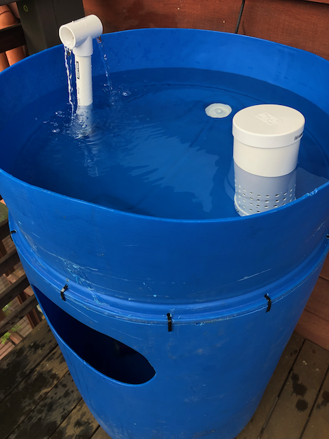
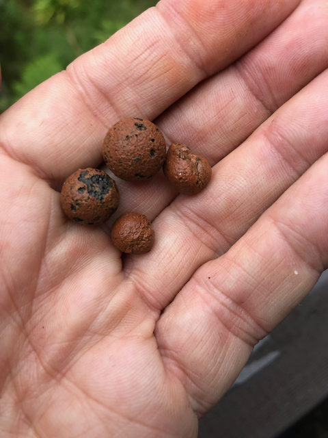
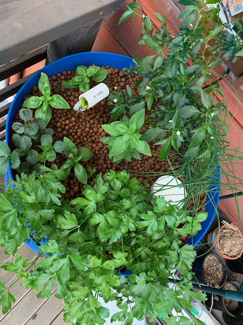

I should confess right upfront that I heavily researched (stole)
most of my ideas from the Aquaponics community and in particular, Rob
Gray, whose excellent [Rob Bob's Aquaponics & Backyard Farm](https://www.youtube.com/channel/UChz2QEbZECEzUih1DiqZTNA)
YouTube channel, is a great source of inspiration and knowledge.

My initial foray into this world was to test the concept using a 200
litre barrel in a 'chop and flip' style. Rob has a [comprehensive video](https://youtu.be/Z2tgrUvSnbM)
describing how to build such a system and it is very simple:

- start with a 200 litre barrel
- cut the top 1/4 of the barrel off and flip it
- place a pump in the bottom and connect it to a pipe through the top
- make a bell siphon to drain the top into the bottom
- fill the top with a suitable grow media

The grow media I used was LECA (light expanded clay aggregate),
little clay balls which are full of tiny holes and provide a medium
for the plants to grow in plus somewhere to host the nitrifying bacteria
that convert the ammonia exuded by the fish into nitrites and then nitrates.

I initially had some goldfish as my ammonia source and I was growing mostly
herbs and leafy greens. This worked really well as you can see:

I am currently running the barrel as a "fishless" system by adding
ammonia directly to the water and supplementing it with nutrients like
"Charlie Carp".

I obtain the ammonia by distillation of Cloudy Ammonia ($1.25 per litre
from Woolworths) which is far cheaper than buying aqueous ammonia from
chemical cupply companies (about $30 per litre and you probably end up
on a persons of interest register...).

This chop and flip barrel opened me up to the possibilities of
Aquaponics growing systems and I have since built a much bigger system
with fish as the primary ammonia source, which I will cover in a later blog post.
